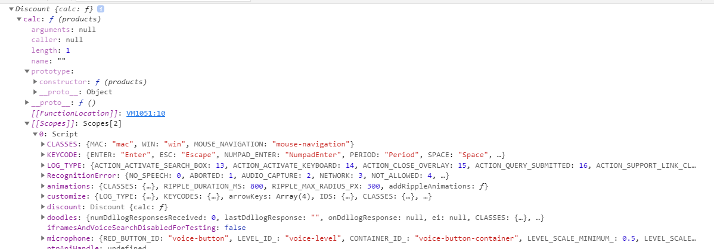
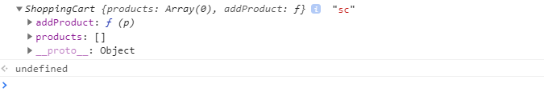
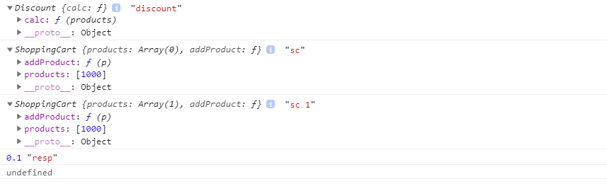
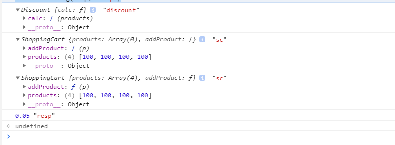
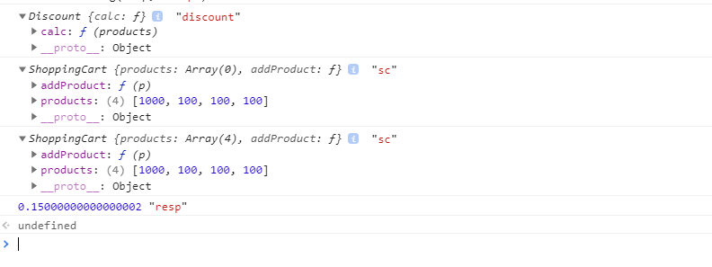
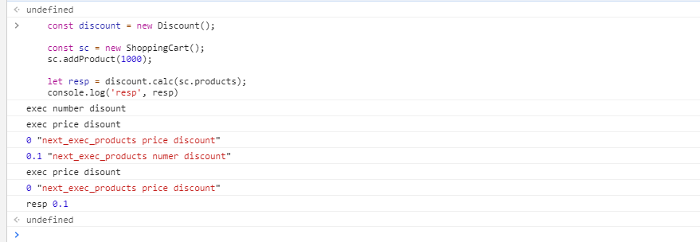

# Giải thích code `chain-of-resp`

## Giải thích các case

## Case 1:

## `> $ 500`

```javascript
const discount = new Discount();
const sc = new ShoppingCart();
sc.addProduct(1000);
let resp = discount.calc(sc.products);
expect(resp).to.equal(0.1);
```

- ### `step 11`:

```javascript
function Discount() {
  this.calc = function (products) {
    var ndiscount = new NumberDiscount();
    var pdiscount = new PriceDiscount();
    var none = new NoneDiscount();

    ndiscount.setNext(pdiscount);
    pdiscount.setNext(none);

    return ndiscount.exec(products);
  };
}
const discount = new Discount();
console.log(discount, "discount");
```



- ### `step 12`:

```javascript
function ShoppingCart() {
  this.products = [];

  this.addProduct = function (p) {
    this.products.push(p);
  };
}
const sc = new ShoppingCart();
```



- ### `step 13`:

```javascript
`Discount`;
function Discount() {
  this.calc = function (products) {
    var ndiscount = new NumberDiscount();
    var pdiscount = new PriceDiscount();
    var none = new NoneDiscount();

    ndiscount.setNext(pdiscount);
    pdiscount.setNext(none);

    return ndiscount.exec(products);
  };
}
```

```javascript
`NumberDiscount`;
function NumberDiscount() {
  this.next = null;
  this.setNext = function (fn) {
    this.next = fn;
  };

  this.exec = function (products) {
    var result = 0;
    if (products.length > 3) result = 0.05;

    return result + this.next.exec(products);
  };
}
```

```javascript
`PriceDiscount`;
function PriceDiscount() {
  this.next = null;

  this.setNext = function (fn) {
    this.next = fn;
  };

  this.exec = function (products) {
    var result = 0;
    var total = products.reduce(function (a, b) {
      return a + b;
    });

    if (total >= 500) result = 0.1;

    return result + this.next.exec(products);
  };
}
```

```javascript
`NoneDiscount`;
function NoneDiscount() {
  this.exec = function () {
    return 0;
  };
}
```

```javascript
const discount = new Discount();
console.log(discount, "discount");
const sc = new ShoppingCart();
console.log(sc, "sc");
sc.addProduct(1000);
console.log(sc, "sc 1");
let resp = discount.calc(sc.products);
console.log(resp, "resp");
```



## Case 2:

## `more than 3 products`

```javascript
const discount = new Discount();
console.log(discount, "discount");

const sc = new ShoppingCart();
console.log(sc, "sc");
sc.addProduct(100);
sc.addProduct(100);
sc.addProduct(100);
sc.addProduct(100);
console.log(sc, "sc");

let resp = discount.calc(sc.products);
console.log(resp, "resp");
```



## Case 3:

## `more than 3 products and > $ 500 `

```javascript
let discount = new Discount();

let sc = new ShoppingCart();
sc.addProduct(1000);
sc.addProduct(100);
sc.addProduct(100);
sc.addProduct(100);

let resp = discount.calc(sc.products);
```


## `Console`

``` javascript
`NumberDiscount`
class NumberDiscount {

  constructor() {
    this.next = null;
  }

  setNext(fn) {
    this.next = fn;
  };

  exec(products) {
    console.log('exec number disount')
    let result = 0;
    if (products.length > 3)
      result = 0.05;
    console.log(this.next.exec(products), 'next_exec_products numer discount')

    return result + this.next.exec(products);
  };
}
```

``` javascript
`PriceDiscount`
class PriceDiscount {

  constructor() {
    this.next = null;
  }

  setNext(fn) {
    this.next = fn;
  };

  exec(products) {
    console.log('exec price disount')
    let result = 0;
    let total = products.reduce((a, b) => a + b);

    if (total >= 500)
      result = 0.1;
    console.log(this.next.exec(products), 'next_exec_products price discount')

    return result + this.next.exec(products);
  };
}
```

- ## All code

```javascript
function ShoppingCart() {
  this.products = [];

  this.addProduct = function (p) {
    this.products.push(p);
  };
}

function Discount() {
  this.calc = function (products) {
    var ndiscount = new NumberDiscount();
    var pdiscount = new PriceDiscount();
    var none = new NoneDiscount();

    ndiscount.setNext(pdiscount);
    pdiscount.setNext(none);

    return ndiscount.exec(products);
  };
}

function NumberDiscount() {
  this.next = null;
  this.setNext = function (fn) {
    this.next = fn;
  };

  this.exec = function (products) {
    var result = 0;
    if (products.length > 3) result = 0.05;

    return result + this.next.exec(products);
  };
}

function PriceDiscount() {
  this.next = null;

  this.setNext = function (fn) {
    this.next = fn;
  };

  this.exec = function (products) {
    var result = 0;
    var total = products.reduce(function (a, b) {
      return a + b;
    });

    if (total >= 500) result = 0.1;

    return result + this.next.exec(products);
  };
}

function NoneDiscount() {
  this.exec = function () {
    return 0;
  };
}
```
