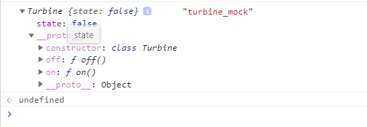

# Example markdown javascript 
```javascript
class Cockpit {

  constructor(command) {
    this.command = command;
  }

  execute() {
    this.command.execute();
  }
}

class Turbine {

  constructor() {
    this.state = false;
  }

  on() {
    this.state = true;
  }

  off() {
    this.state = false;
  }
}

class OnCommand {

  constructor(turbine) {
    this.turbine = turbine;
  }

  execute() {
    this.turbine.on();
  }
}

class OffCommand {

  constructor(turbine) {
    this.turbine = turbine;
  }

  execute() {
    this.turbine.off();
  }
}

var turbine = new Turbine();
const onCommand = new OnCommand(turbine);
const cockpit = new Cockpit(onCommand);
cockpit.execute();
console.log(turbine.state)
```
## `giải thích code`

```
var turbine = new Turbine();
```

### ta new một class là `turbin`, dưới đây là mô tả trên google dev tool



