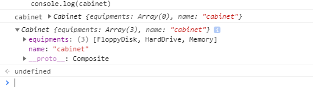

## Tìm hiểu design Pattern Composite
``` javascript
    const cabinet = new Cabinet();
    cabinet.add(new FloppyDisk());
    cabinet.add(new HardDrive());
    cabinet.add(new Memory());

    expect(cabinet.getPrice()).to.equal(600);
```
ta thấy const cabinet = new Cabinet()
ta thấy `Cabinet` kêt thừa thằng `Composite`

nên nó sẽ sử dụng được constructor của `Composite`

``` javascript
class Composite extends Equipment {

  constructor() {
    super();
    this.equipments = [];
  }

  add(equipment) {
    this.equipments.push(equipment);
  }
```
- cabinet.add(new FloppyDisk());
- cabinet.add(new HardDrive());
- cabinet.add(new Memory());
 this.equiments = [FloppyDisk, HardDrive, Memory]

nhìn vào đoạn code bên dưới ta thấy
``` javascript
cabinet.getPrice()
```
- ta thấy `FloppyDisk`, `HardDrive`, `Memory` kế thừa `Composite`
- `Composite` kế thừa `Equipment`
- `Cabinet` kê thừa `Composite`

khi gọi cabinet.getPrice()
thì nó sẽ gọi `getPrice()` của `Composite`

``` javascript
getPrice() {
    return this.equipments.map(equipment => {
      return equipment.getPrice();
    }).reduce((a, b) => {
      return a + b;
    });
  }
```

- như vậy
- result là price FloppyDisk + price HardDrive + price HardDrive
- 70 + 250 + 280 = 600


``` javascript
class Cabinet extends Composite {
  constructor() {
    super();
    this.setName('cabinet');
  }
}
```




sau cái này thi constructor 
```javascript
//Equipment
class Equipment {

  getPrice() {
    return this.price || 0;
  }

  getName() {
    return this.name;
  }

  setName(name) {
    this.name = name;
  }
}

// --- composite ---
class Composite extends Equipment {

  constructor() {
    super();
    this.equipments = [];
  }

  add(equipment) {
    this.equipments.push(equipment);
  }

  getPrice() {
    return this.equipments.map(equipment => {
      return equipment.getPrice();
    }).reduce((a, b) => {
      return a + b;
    });
  }
}

class Cabinet extends Composite {
  constructor() {
    super();
    this.setName('cabinet');
  }
}

// --- leafs ---


class FloppyDisk extends Equipment {
  constructor() {
    super();
    this.setName('Floppy Disk');
    this.price = 70;
  }
}

class HardDrive extends Equipment {
  constructor() {
    super();
    this.setName('Hard Drive');
    this.price = 250;
  }
}

class Memory extends Equipment {
  constructor() {
    super();
    this.setName('Memory');
    this.price = 280;
  }
}
```
