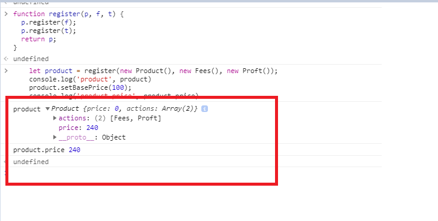
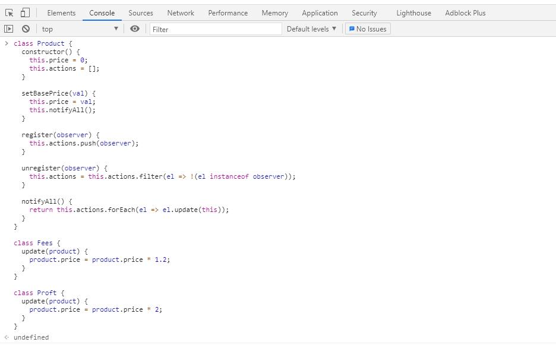
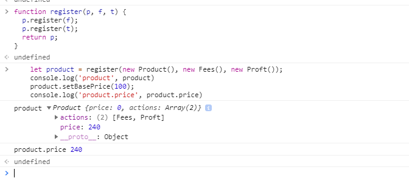

# Tìm hiểu về Design Pattern observer javascript

``` javascript
function register(p, f, t) {
  p.register(f);
  p.register(t);
  return p;
}
```
### ta bắt đầu xem đoạn code dưới đây:
``` javascript
let product = register(new Product(), new Fees(), new Proft())
```


- ta thấy khúc này sẽ trả về 

``` javascript
p.register(f);
p.register(t);
```
Đoạn code này product call 
`Product` method
this.action.push(Fees)
this.action.push(Proft)

lúc này `Product` sẽ có dạng như sau:
`this.actions  = [Fees, Proft]`
như vậy có thể thấy dùng `observer` 

ta không cần phải sử dụng `contructor tham số` mà truyền `trực tiếp` vào

``` javascript
product.setBasePrice(100)
```
- ta có thể thấy trong class `Product`
- có method
``` javascript
  setBasePrice(val) {
    this.price = val;
    this.notifyAll();
  }

  notifyAll() {
    return this.actions.forEach(el => el.update(this));
  }
```
- product.setBasePrice(100)
lúc này price của `Product` = 100
- this.action = [Fees, Proft]
- this.actions.forEach(el => el.update(this));
- => Fees.update, Profct.update

- ta thấy trong class `Fees` có method `update`
``` javascript
  update(product) {
    product.price = product.price * 1.2;
  }
```
lúc này `product.price = 100* 1.2 = 120`
- tiếp tục thấy trong class `Proft` cũng có phương thức `update`
``` javascript
  notifyAll() {
    return this.actions.forEach(el => el.update(this));
  }

  loop
  product.price = product.price * 1.2;
  product.price = product.price * 2;
```
- lúc này ` product.price = 120 * 2 = 240`
- phương thức này sẽ nhân dồn `100 * 1.2 * 2`




``` javascript
class Product {
  constructor() {
    this.price = 0;
    this.actions = [];
  }

  setBasePrice(val) {
    this.price = val;
    this.notifyAll();
  }

  register(observer) {
    this.actions.push(observer);
  }

  unregister(observer) {
    this.actions = this.actions.filter(el => !(el instanceof observer));
  }

  notifyAll() {
    return this.actions.forEach(el => el.update(this));
  }
}

class Fees {
  update(product) {
    product.price = product.price * 1.2;
  }
}

class Proft {
  update(product) {
    product.price = product.price * 2;
  }
}

```
