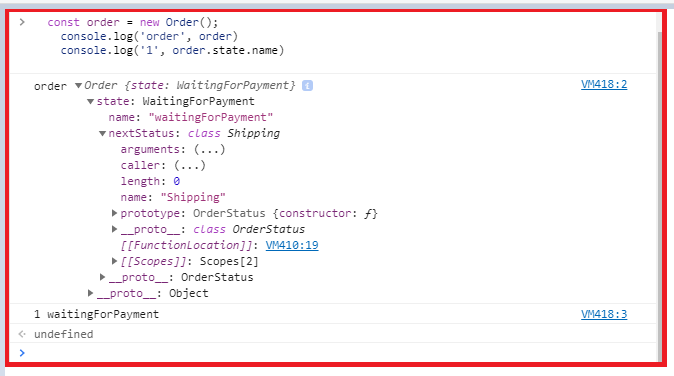
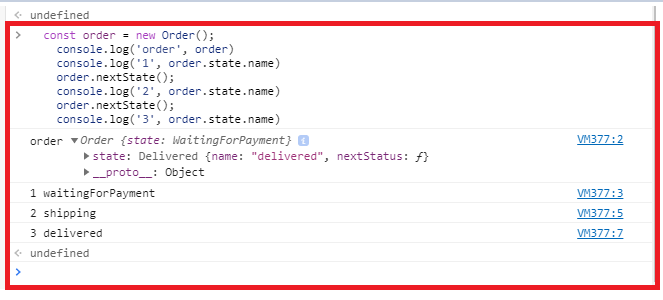
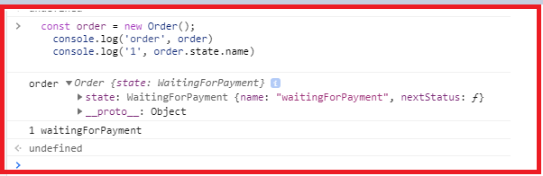

# Tìm hiểu về Design Pattern state
``` javascript
    const order = new Order();
    expect(order.state.name).to.equal('waitingForPayment');
    order.nextState();
    expect(order.state.name).to.equal('shipping');
    order.nextState();
    expect(order.state.name).to.equal('delivered');
```

- ta thấy trong class Order
``` javascript
this.state = new WaitingForPayment()
```
- ta tiếp tục thấy class `WaitingForPayment`
``` javascript
class WaitingForPayment extends OrderStatus {
  constructor() {
    super('waitingForPayment', Shipping);
  }
}
```
- phương thức khởi tạo của nó kế thừa `OrderStatus`
- thấy trong constructor của `OrderStatus`
``` javascript
class OrderStatus {
  constructor(name, nextStatus) {
    this.name = name;
    this.nextStatus = nextStatus;
  }

  next() {
    return new this.nextStatus();
  }
}
```
- như vậy lúc này
- `this.name = 'waitingForPayment'`
- `this.nextStatus = Shipping`

``` javascript
order.nextState();
```
- ta tiếp tục nhìn vào class `Order`
``` javascript
  nextState() {
    this.state = this.state.next();
  };
```
``` javascript
class Shipping extends OrderStatus {
  constructor() {
    super('shipping', Delivered);
  }
}
```
- vì `this.state = new WaitingForPayment();`
- mà class `WaitingForPayment` kế thừa `OrderStatus`
- => `new this.nextStatus()` === `new Shipping()`
- nhìn vào `constructor` của `Shipping` ta có thể suy ra:
- suy ra `this.name === 'shipping'`
- và `this.nextStatus === Delivered`





``` javascript
class OrderStatus {
  constructor(name, nextStatus) {
    this.name = name;
    this.nextStatus = nextStatus;
  }

  next() {
    return new this.nextStatus();
  }
}

class WaitingForPayment extends OrderStatus {
  constructor() {
    super('waitingForPayment', Shipping);
  }
}

class Shipping extends OrderStatus {
  constructor() {
    super('shipping', Delivered);
  }
}

class Delivered extends OrderStatus {
  constructor() {
    super('delivered', Delivered);
  }
}

class Order {
  constructor() {
    this.state = new WaitingForPayment();
  }

  nextState() {
    this.state = this.state.next();
  };
}

```